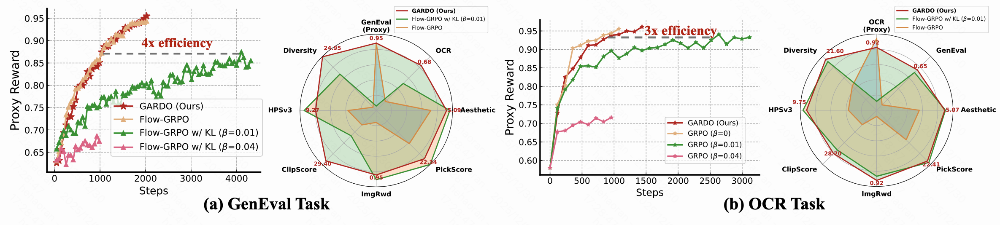

# GARDO: Reinforcing Diffusion Models without Reward Hacking


## 📖 Introduction
Fine-tuning diffusion models via online reinforcement learning (RL) suffers from reward hacking, where proxy scores increase while real image quality deteriorates and generation diversity collapses. To address the competing demands of *sample efficiency*, *effective exploration*, and *mitigation of reward hacking*, we propose **G**ated and **A**daptive **R**egularization with **D**iversity-aware **O**ptimization (**GARDO**), a versatile framework compatible with various RL algorithms. GARDO can be applied on both [Flow-GRPO](https://github.com/yifan123/flow_grpo) and [DiffusionNFT](https://github.com/NVlabs/DiffusionNFT).
<div align="center">
    
</div>

## 🧠 Method

- Our key insight is that regularization need not be applied universally; instead, it is highly effective to <font color="Blue">selectively penalize</font> a subset of samples that exhibit high uncertainty. 
- To address the exploration challenge, GARDO introduces an adaptive regularization mechanism wherein the reference model is periodically updated to match the capabilities of the online policy, ensuring <font color="Blue">a relevant regularization target</font>. 
- To address the mode collapse issue in RL, GARDO amplifies the rewards for high-quality samples that also exhibit high diversity, encouraging <font color="Blue">mode coverage</font> without destabilizing the optimization process.
<div align="center">
    
</div>

## 🛠️ Instructions
Set up the environment
```
git clone https://github.com/tinnerhrhe/GARDO.git
cd GARDO
conda create -n gardo python=3.10 -y
conda activate gardo
pip install -e .
pip install timm==1.0.20 hpsv2x==1.2.0 hpsv3
```
&#128073; Please follow the instructions of [Flow-GRPO](https://github.com/yifan123/flow_grpo#3-reward-preparation) for reward preparation. We support [GenEval](https://github.com/djghosh13/geneval), [OCR](https://github.com/PaddlePaddle/PaddleOCR), [PickScore](https://github.com/yuvalkirstain/PickScore), [ClipScore](https://github.com/openai/CLIP), [HPSv3](https://github.com/MizzenAI/HPSv3), [Aesthetic](https://github.com/christophschuhmann/improved-aesthetic-predictor), [ImageReward](https://github.com/zai-org/ImageReward) and [UnifiedReward](https://github.com/CodeGoat24/UnifiedReward) for training and evaluation.

&#128073; To implement the diversity-aware advantage shaping, please download the [dinov3](https://github.com/facebookresearch/dinov3) model and set the path in the codes:
```
huggingface-cli download timm/vit_large_patch16_dinov3.lvd1689m --local-dir <your path>
```
### Start Training
After downloading all the required models and setting up the environment, run the following script to start training the GARDO.
```
bash scripts/single_node/grpo_gardo_sd3.sh 
```


